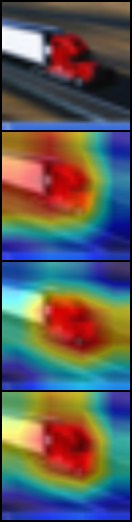
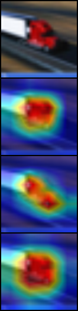

# cnn-distillation
[WIP] Pytorch-lightning framework for knowledge distillation experiments with CNN.

[](https://github.com/maximzubkov/cnn-distillation/actions?query=workflow%3ABuild)

-------
#### Введение

Данный репозиторий содержит в себе решение вступительного испытания в VK lab.
Задание заключается в том, чтобы придумать и поставить эксперименты показывающие 
работоспособность метода `Knowledge Distillation`. 
Данную работу я решил сделать в виде цельного, расширяемого репозитория. 
Мне это кажется важным, так как на мой взгляд многие 
разработки VK lab имеют шанс быть использованными в продакшене. Для достижения этих целей я
использовал популярный фреймворки [pytorch-lightning](https://pytorch-lightning.readthedocs.io/en/l…) 
и [W&B](https://wandb.ai). Также я настроил базовый `CI` пайплайн 
с помощью `Github Actions` и сохранил большие файлы с `checkpoint` моделей
при помощи `github-lfs`. 

-------
#### Постановка задачи и шаги решения

Цель данной работы заключается в том, чтобы изучить некоторые существующие подходы 
`Knowledge Distillation`, а также реализовать фреймворк, который можно 
было бы в последствии расширить. Я решил использовать датасет `cifar10` 
из-за того, что он есть в `torchvision` и он простой, все эксперименты
были сделаны над моделями `Resnet`. В качестве студента вступала модель `Resnet18`, а
в качестве учителя модель `Resnet50`

Работу можно разделить на несколько этапов:
> Для начала я решил реализовать классы `BaseCifarModel` и `SingleCifarModel`, а также 
> модели `Resnet18` и `Resnet50` и обучить их на `cifar10`. 
> Каждую модель я обучил как `from scratch`, так и c заморозкой нескольких слоев. 
> Первый мой эксперимент был в том, что я в `Resnet` заморозил все слои кроме классификатора, 
> но по итогу я получил низкое значение `accuracy` (порядка 85%). Далее я наткнулся на 
> статью на [kaggle](https://www.kaggle.com/nkaenzig/cnn-transfer-learning-secrets) и 
> воспользовался оттуда двумя советами:
> * Увеличить размер входной картинки (поэкспериментировав, я остановился на `128x128`). 
> Так как исходная модель была обучена на `ImageNet` (размер картинок в котором `224x224`), 
> то такой размер будет для модели более приятным
> * Разморозить `BatchNormalization`. Данное улучшение так же кажется логичным, 
> так как свертки обучены на `ImageNet`
> достаточно хорошо, а вот масштабы и локализация объектов в `cifar10` 
> может немного отличать от `ImageNet`.

> Далее я реализовал `DistillationCifarModel` и `loss` функцию из следующей 
> [статьи](http://cs230.stanford.edu/files_winter_2018/projects/6940224.pdf).
> Результаты получились хорошими не сразу, достаточно много времени пришлось 
> потратить на подбор гиперпараметеров.

> Я имею опыт работы с `GAN` и поэтому мне показалось хорошей идея использовать
> своего рода дискриминатор для `logits` моделей. Дискриминатор принимает в себя 
> `logits` студента и выдает вероятность того, что данные `logits` получены от 
> учителя. При этом дискриминатор и студент учатся по очереди, я тестировал разные 
> стратегии, к примеру следующую: 30 шагов учится дискриминатор,
> а следующие 170 студент. В качестве `loss` я использовал популярный `Wasserstein loss`
> Реализацию можно найти в классе `LogitsDiscriminatorCifarModel`.

> Наконец, не получив ожидаемого результата с `GAN`, я решил воспроизвести результат
> статьи [RKD](https://arxiv.org/pdf/1904.05068.pdf), к счастью тут я получил более 
> позитивные результаты.

> Затем мне стало интересно сравнить куда смотрят те или иные сети, когда делают свои 
> предсказания и насколько сильно "взгляд" студента похож на взгляд учителя при 
> использовании `Knowledge Distillation`. Для этого я воспользовался подходом 
> [grad-cam](https://arxiv.org/abs/1610.02391), реализованным в библиотеке `gradcam`.

#### Запуск экспериментов

Запускать следующие команды необходимо из директории `cnn-distillation` 
> Перед запуском экспериментов необходимо установить все необходимые библиотеки, 
это можно сделать при помощи команды.
> ```bash
> sh scripts/build.sh
> ```

> Все эксперименты можно запустить, используя команду 
> ```bash
> sh scripts/train.sh
> ```

> Если необходимо запустить обучения какого-то конкретного эксперимента необходимо 
> выполнить команду
> ```bash
> python train.py <experiment name> 
> ```
> Также можно добавить флаг `--unfrozen`, чтобы выбрать модель со всеми размороженными слоями  
> Названия эксперимнтов следующие:
> * Обучение студента без учителя: `student`
> * Обучение учителя: `teacher`
> * Обучение студента c учителем с использованием KD Loss 
> из [статьи](http://cs230.stanford.edu/files_winter_2018/projects/6940224.pdf): `kd_distillation`
> * Обучение студента c учителем с использованием RKD Distance Loss 
> из [статьи](https://arxiv.org/pdf/1904.05068.pdf): `rkdd_distillation`
> * Обучение студента c учителем с использованием Logits Discriminator Loss: `ld_distillation`

> Обученные модели сохранены в папке `models/checkpoints`. Чтобы получить оценки 
> качества всех моделей необходимо выполнить команду 
> ```bash
> sh scripts/eval.sh
> ```
> Если необходимы метрики какого-то конкретного эксперимента нужно 
> выполнить команду
>```bash
> python eval.py <path to .ckpt file> <experiment name>
> ```
> В данном случае видов экспериментов всего три: [`teacher`,`student`,`distillation`],
> а соответствующие экспериментам `.ckpt` названия файлов представлены в таблице с результатами 

-------
#### Результаты 

Здесь представлена выжимка результатов, более подробный обзор доступен по [ссылке](https://wandb.ai/maximzubkov/distillation-freezed-KD/reports/Validation-Report--VmlldzoyNTQzMDg?accessToken=4ge4d4rzrofag42riufy0xkkwr8e7l1pqn3285buckb0rw3z6nqk1493861f0cuu)

| Student  | Teacher  | Method                | Pretrained | Freeze Encoder | Accuracy | `.ckpt` file                     |
|----------|----------|-----------------------|------------|----------------|----------|----------------------------------|
| ResNet18 | ❌        | Cross Entropy        |     ✅      |       ✅       |  93.05   |student.ckpt                      |
| ResNet18 | ❌        | Cross Entropy        |     ✅      |       ❌       |  93.65   |student_unfrozen.ckpt             | 
| ResNet50 | ❌        | Cross Entropy        |     ✅      |       ✅       |  95.71   |teacher.ckpt                      |
| ResNet50 | ❌        | Cross Entropy        |     ✅      |       ❌       |  93.83   |teacher_unfrozen.ckpt             |
| ResNet18 | ResNet50  | Default KD loss      |     ✅     |       ✅        |  93.29   |distillation_kd.ckpt              |
| ResNet18 | ResNet50  | Default KD loss      |     ✅     |       ❌        |  94.26   |distillation_kd_unfrozen.ckpt     |
| ResNet18 | ResNet50  | RKD Distance loss    |     ✅     |       ✅        |  93.24   |distillation_rkdd.ckpt            |
| ResNet18 | ResNet50  | RKD Distance loss    |     ✅     |       ❌        |  94.43   |distillation_rkdd_unfrozen.ckpt   |
| ResNet18 | ResNet50  | Logits Discriminator |     ✅     |       ✅        |  92.56   |distillation_ld.ckpt              |
| ResNet18 | ResNet50  | Logits Discriminator |     ✅     |       ❌        |  93.46   |distillation_ld_unfrozen.ckpt     |

#### Интерпретация

Теперь сравним результаты работы `grad-cam`. Результаты представлены в следующем 
порядке:
* Исходное изображение
* Студент `Resnet18` с учителем `Resnet50`
* Учитель `Resnet50`
* Студент `Resnet18` без учителя

* Все слои кроме `BatchNorm` и классификатора заморожены


* Все слои разморожены



#### Выводы

По результатам можно видеть, что подход `Knowledge Distillation` действительно 
работает, в связи с чем имеет смысл продолжать изучение данного метода. Гипотеза 
о том, что введение своеобразного дискриминатора для `logits` поможет обучению
не подтвердилась во время экспериментов, однако возможно дело было в недостаточно 
аккуратном подборе гиперпараметров сети